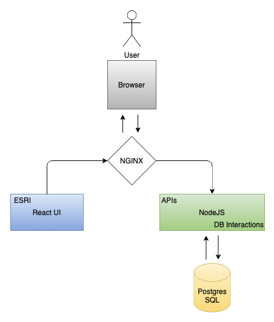

### Getting Started
Clone the repository and run the following command to run the setup

` docker compose up`
---
### High Level Design

---

#### Use this to force update the DB and other containers
`docker-compose up --build --force-recreate`
